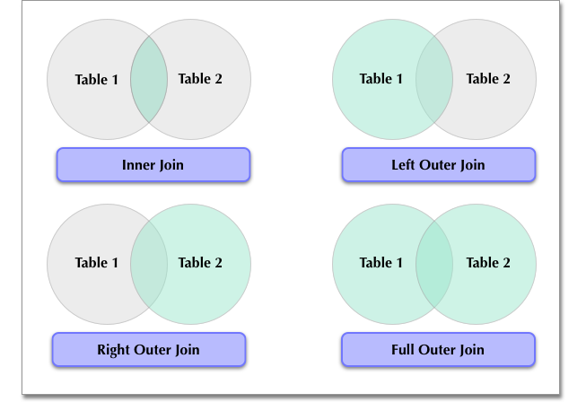

## SQL : Basics, Joins, and Aggregations

### 1. **SQL Basics**
SQL (Structured Query Language) is a standard language used for managing and manipulating relational databases. This report will cover the essential SQL commands, including examples to illustrate each concept.

#### 1.1 **Creating Tables**

The `CREATE TABLE` statement defines a new table by specifying columns and their data types. Let’s create a table called `Students` to store student data such as their ID, name, class, and age.

```sql
CREATE TABLE Students (
    StudentID INT PRIMARY KEY,      -- Unique ID for each student
    FirstName VARCHAR(50),          -- First name of the student
    LastName VARCHAR(50),           -- Last name of the student
    Class VARCHAR(10),              -- Class the student is in, e.g., "Grade 5"
    Age INT                         -- Age of the student
);
```

#### 1.2 **Inserting Data**

The `INSERT INTO` statement adds rows to a table. Here’s how to add data for some students in our `Students` table:

```sql
INSERT INTO Students (StudentID, FirstName, LastName, Class, Age)
VALUES 
(1, 'Emma', 'Smith', 'Grade 5', 10),
(2, 'Liam', 'Brown', 'Grade 5', 11),
(3, 'Sophia', 'Davis', 'Grade 6', 12),
(4, 'James', 'Wilson', 'Grade 5', 10);
```

#### 1.3 **Querying Data**

The `SELECT` statement retrieves data from a table. Some commonly used clauses are:

- **SELECT**: Specifies the columns to display.
- **FROM**: Indicates the table to retrieve data from.
- **WHERE**: Adds conditions to filter rows.
- **ORDER BY**: Sorts the results.

Example: Retrieve all students in "Grade 5," sorted by `FirstName`.

```sql
SELECT FirstName, LastName, Class
FROM Students
WHERE Class = 'Grade 5'
ORDER BY FirstName;
```

#### 1.4 **Updating Data**

The `UPDATE` statement modifies existing records in a table. Use the `WHERE` clause to specify which rows to update.

```sql
-- Update age for student with ID 1 to 11
UPDATE Students
SET Age = 11
WHERE StudentID = 1;
```

#### 1.5 **Deleting Data**

The `DELETE` statement removes rows from a table. Use the `WHERE` clause to specify which rows to delete.

```sql
-- Remove student with ID 4
DELETE FROM Students
WHERE StudentID = 4;
```

---

### 2. **SQL Joins**

Joins combine rows from two or more tables based on related columns. Here are different types of joins with examples.




Suppose we have another table, `Marks`, which records students’ scores in a test:

```sql
CREATE TABLE Marks (
    StudentID INT,                    -- ID of the student (matches Students table)
    Subject VARCHAR(50),              -- Subject of the test, e.g., "Math"
    Score INT                         -- Score the student received
);

-- Insert data into Marks table
INSERT INTO Marks (StudentID, Subject, Score)
VALUES 
(1, 'Math', 85),
(2, 'Math', 78),
(1, 'Science', 90),
(3, 'Math', 88),
(3, 'Science', 75);
```

#### 2.1 **Inner Join**


An `INNER JOIN` retrieves rows that have matching values in both tables.

```sql
SELECT 
    Students.FirstName,
    Students.LastName,
    Marks.Subject,
    Marks.Score
FROM 
    Students
INNER JOIN 
    Marks ON Students.StudentID = Marks.StudentID;
```

This query shows students with their scores in each subject for students who have records in both tables.

#### 2.2 **Left Join**

A `LEFT JOIN` returns all rows from the left table and the matched rows from the right table. If there is no match, NULL values are returned for columns from the right table.

```sql
SELECT 
    Students.FirstName,
    Students.LastName,
    Marks.Subject,
    Marks.Score
FROM 
    Students
LEFT JOIN 
    Marks ON Students.StudentID = Marks.StudentID;
```

This query returns all students, showing NULL for students with no matching scores in `Marks`.

#### 2.3 **Right Join**

A `RIGHT JOIN` returns all rows from the right table and the matched rows from the left table.

```sql
SELECT 
    Students.FirstName,
    Students.LastName,
    Marks.Subject,
    Marks.Score
FROM 
    Marks
RIGHT JOIN 
    Students ON Students.StudentID = Marks.StudentID;
```

This query shows all scores in `Marks`, even for students not found in `Students`, with NULLs for unmatched data.

#### 2.4 **Full Outer Join**

A `FULL OUTER JOIN` returns all rows from both tables, with NULLs where there is no match.

```sql
SELECT 
    Students.FirstName,
    Students.LastName,
    Marks.Subject,
    Marks.Score
FROM 
    Students
FULL OUTER JOIN 
    Marks ON Students.StudentID = Marks.StudentID;
```

This query combines all rows from both tables, with NULLs for any non-matching entries in either table.

---

### 3. **SQL Aggregations**

Aggregation functions perform calculations on groups of data. Here are some of the most commonly used aggregation functions.

#### 3.1 **COUNT()**

Counts the number of records. Useful for counting entries in a table or for a specific category.

Example: Count the number of students in each class.

```sql
SELECT 
    Class,
    COUNT(StudentID) AS NumberOfStudents
FROM 
    Students
GROUP BY 
    Class;
```

#### 3.2 **SUM()**

Calculates the sum of a column, such as total scores.

```sql
SELECT 
    Subject,
    SUM(Score) AS TotalScore
FROM 
    Marks
GROUP BY 
    Subject;
```

#### 3.3 **AVG()**

Calculates the average of a column. For instance, to find the average score per subject:

```sql
SELECT 
    Subject,
    AVG(Score) AS AverageScore
FROM 
    Marks
GROUP BY 
    Subject;
```

#### 3.4 **MIN() and MAX()**

`MIN()` and `MAX()` find the smallest and largest values in a column.

Example: Get the highest and lowest score for each subject.

```sql
SELECT 
    Subject,
    MIN(Score) AS LowestScore,
    MAX(Score) AS HighestScore
FROM 
    Marks
GROUP BY 
    Subject;
```

For more information on other aggregate functions, please refer to [W3Schools SQL Tutorial](https://www.w3schools.com/sql/).

---

### 4. **Combining Joins and Aggregations**

Combining joins with aggregations is useful for analyzing data across multiple tables. Here’s an example to calculate the average score per student across all subjects.

```sql
SELECT 
    Students.FirstName,
    Students.LastName,
    COALESCE(AVG(Marks.Score), 0) AS AverageScore
FROM 
    Students
LEFT JOIN 
    Marks ON Students.StudentID = Marks.StudentID
GROUP BY 
    Students.FirstName, Students.LastName;
```

In this query:
- **COALESCE** replaces NULL with 0 for students who have no scores.
- `LEFT JOIN` ensures that all students are included, even if they don’t have scores.

---

### References

- W3Schools. SQL Tutorial. [https://www.w3schools.com/sql/](https://www.w3schools.com/sql/)
- SQL Joins - Full Course. [https://www.youtube.com/watch?v=H6988OpZKTU](https://www.youtube.com/watch?v=H6988OpZKTU)
- SQL Crash Course. [https://www.youtube.com/watch?v=yH1zCq-iaeU&list=PLdOKnrf8EcP17p05q13WXbHO5Z_JfXNpw](https://www.youtube.com/watch?v=yH1zCq-iaeU&list=PLdOKnrf8EcP17p05q13WXbHO5Z_JfXNpw)

